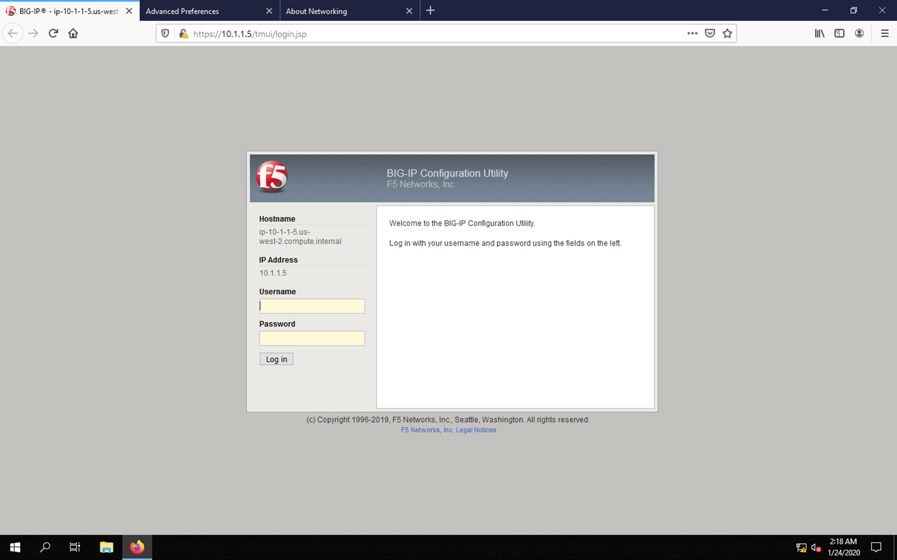
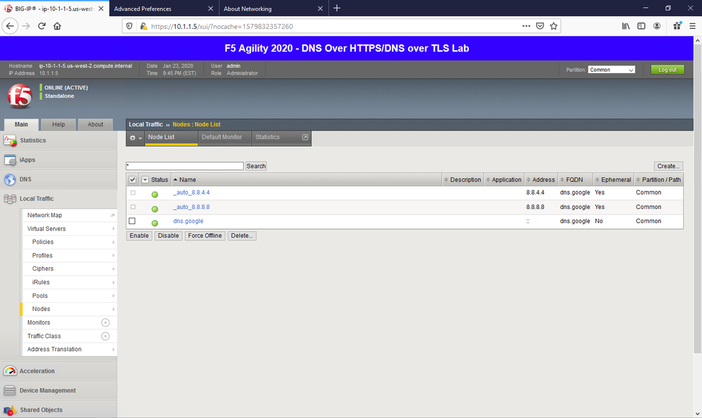
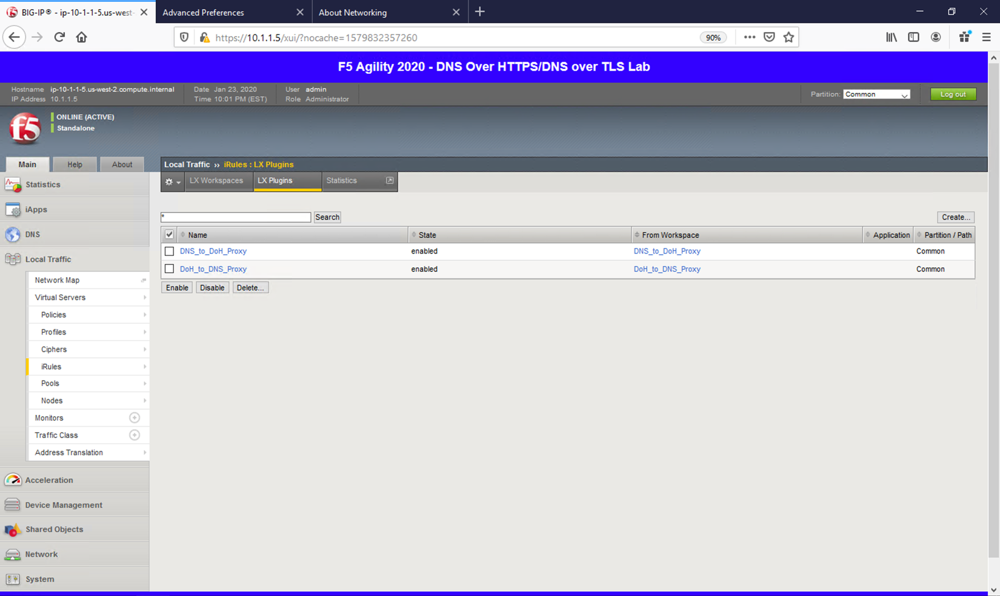
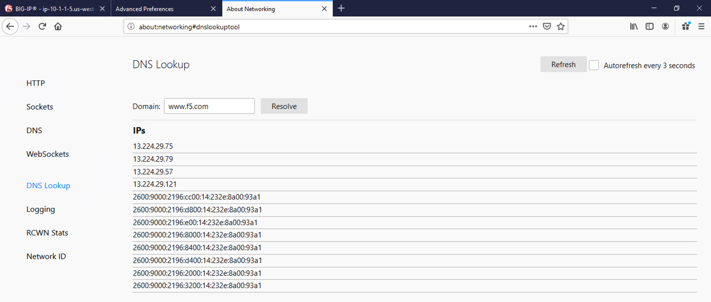
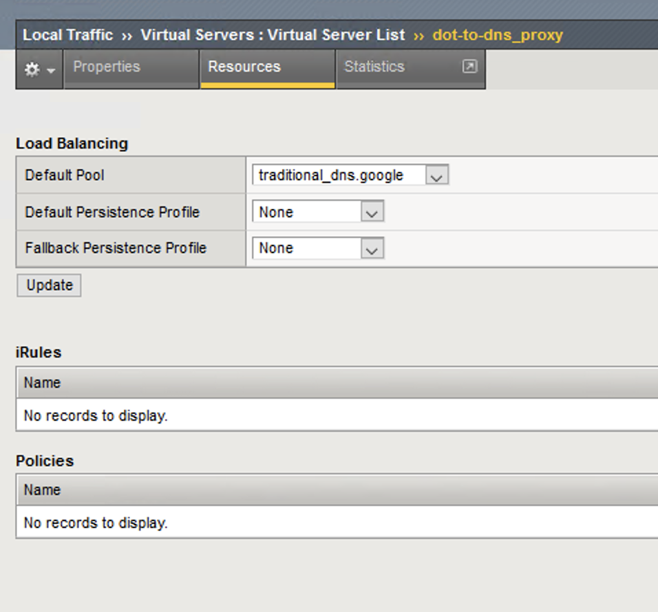
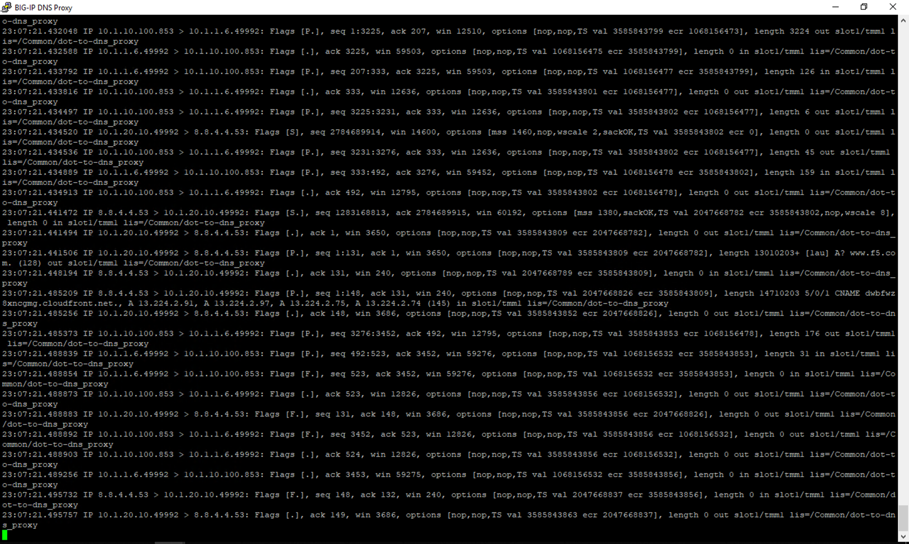
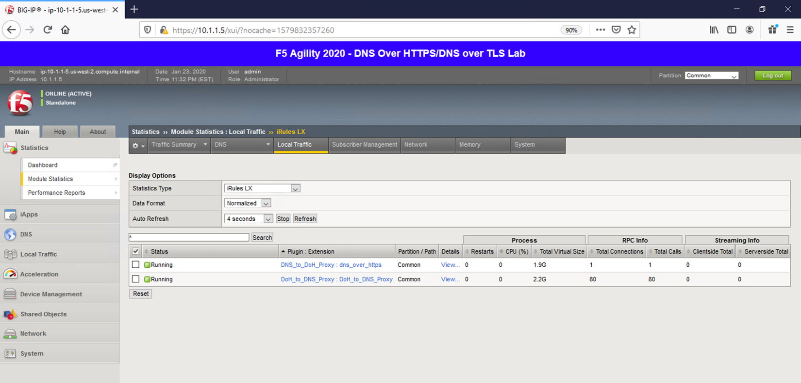

Detecting and Preventing DNS DoS Attacks on a Virtual Server
------------------------------------------------------------

Establishing a DNS server baseline
~~~~~~~~~~~~~~~~~~~~~~~~~~~~~~~~~~

Before we can attack our DNS server, we should establish a baseline for
how many QPS our DNS server can handle. For this lab, let’s find the
magic number of QPS that causes 50% CPU utilization on the BIND process.

1. Connect to the Victim Server SSH session by double-clicking the
   **Victim Server (Ubuntu)** shortcut on the jump host desktop.

2. From the BASH prompt, enter **top** and press **Enter** to start the
   top utility.

3. You will see a list of running processes sorted by CPU utilization,
   like the output below:

   |image10|

4. Connect to the Attack Host SSH session by double-clicking the
   **Attack Host (Ubuntu)** shortcut on the jump host desktop.

5. | Start by sending 500 DNS QPS for 30 seconds to the host using the
     following syntax:
   | dnsperf -s 10.20.0.10 -d queryfile-example-current -c 20 -T 20 -l
     30 -q 10000 -Q 500

6. Observe CPU utilization over the 30 second window for the **named**
   process. If the CPU utilization is below 45%, increase the QPS by
   increasing the -Q value. If the CPU utilization is above 55%,
   decrease the QPS.

7. Record the QPS required to achieve a sustained CPU utilization of
   approximately 50%. Consider this the QPS that the server can safely
   sustain for demonstration purposes.

8. | Now, attack the DNS server with 10,000 QPS using the following
     syntax:
   | dnsperf -s 10.20.0.10 -d queryfile-example-current -c 20 -T 20 -l
     30 -q 10000 -Q 10000

9. You’ll notice that the CPU utilization on the victim server
   skyrockets, as well as DNS query timeout errors appearing on the
   attack server’s SSH session. This shows your DNS server is
   overwhelmed.

Configuring a DoS Logging Profile
~~~~~~~~~~~~~~~~~~~~~~~~~~~~~~~~~

We’ll create a DoS logging profile so that we can see event logs in the
BIG-IP UI during attack mitigation.

1. On the BIG-IP web UI, navigate to **Security** > **Event Logs** >
   **Logging Profiles** and create a new profile with the following
   values, leaving unspecified attributes at their default value:

   a. Profile Name: dns-dos-profile-logging

   b. DoS Protection: Enabled

   c. | DNS DoS Protection Publisher: local-db-publisher
      | |image11|

Configuring a DoS Profile
~~~~~~~~~~~~~~~~~~~~~~~~~

We’ll now create a DoS profile with manually configured thresholds to
limit the attack’s effect on our server.

1. | Navigate to **Security** > **DoS Protection** > **DoS Profiles**
     and create a new DoS profile with the name **dns-dos-profile**.
   | |image12|

2. The UI will return to the DoS Profiles list. Click the
   **dns-dos-profile** name.

3. Click the **Protocol Security** tab and select **DNS Security** from
   the drop-down.

4. Click the **DNS A Query** vector from the Attack Type list.

5. Modify the **DNS A Query** vector configuration to match the
   following values, leaving unspecified attributes with their default
   value:

   a. State: Mitigate

   b. Threshold Mode: Fully Manual

   c. Detection Threshold EPS: (Set this at 80% of your safe QPS value)

   d. | Mitigation Threshold EPS: (Set this to your safe QPS value)
      | |image13|

6. Make sure that you click **Update** to save your changes.

Attaching a DoS Profile
~~~~~~~~~~~~~~~~~~~~~~~

We’ll attach the DoS profile to the virtual server that we configured to
manage DNS traffic.

1. Navigate to **Local Traffic** > **Virtual Servers** > **Virtual
   Server List**.

2. Click on the **udp\_dns\_VS** name.

3. Click on the **Security** tab and select **Policies**.

4. In the **DoS Protection Profile** field, select **Enabled** and
   choose the **dns-dos-profile**.

5. In the **Log Profile**, select **Enabled** and move the
   **dns-dos-profile-logging** profile from **Available** to
   **Selected**.

6. Click **Update**.

Simulate a DNS DDoS Attack
~~~~~~~~~~~~~~~~~~~~~~~~~~

1. Open the SSH session to the victim server and ensure the top utility
   is running.

2. | Once again, attack your DNS server from the attack host using the
     following syntax:
   | dnsperf -s 10.20.0.10 -d queryfile-example-current -c 20 -T 20 -l
     30 -q 10000 -Q 10000

3. On the server SSH session running the top utility, notice the CPU
   utilization on your server remains in a range that ensures the DNS
   server is not overwhelmed.

4. | After the attack, navigate to **Security** > **Event Logs** >
     **DoS** > **DNS Protocol**. Observe the logs to see the mitigation
     actions taken by the BIG-IP.
   | |image14|

DNS DDoS Mitigations for Continued Service
~~~~~~~~~~~~~~~~~~~~~~~~~~~~~~~~~~~~~~~~~~

At this point, you’ve successfully configured the BIG-IP to limit the
amount of resource utilization on the BIG-IP. Unfortunately, even valid
DNS requests can be caught in the mitigation we’ve configured. There are
further steps that can be taken to mitigate the attack that will allow
non-malicious DNS queries.

Bad Actor Detection
^^^^^^^^^^^^^^^^^^^

Bad actor detection and blacklisting allows us to completely block
communications from malicious hosts at the BIG-IP, completely preventing
those hosts from reaching the back-end servers. To demonstrate:

1.  Navigate to **Security** > **DoS Protection** > **DoS Profiles**.

2.  Click on the **dns-dos-profile** profile name.

3.  Click on the **Protocol Security** tab then select **DNS Security**.

4.  Click on the **DNS A Query** attack type name.

5.  Modify the vector as follows:

    a. Bad Actor Detection: Checked

    b. Per Source IP Detection Threshold EPS: 80

    c. Per Source IP Mitigation Threshold EPS: 100

    d. Add Source Address to Category: Checked

    e. Category Name: denial\_of\_service

    f. Sustained Attack Detection Time: 15 seconds

    g. | Category Duration Time: 60 seconds
       | |image15|

6.  Make sure you click **Update** to save your changes.

7.  Navigate to **Security** > **Network Firewall** > **IP
    Intelligence** > **Policies** and create a new IP Intelligence
    policy with the following values, leaving unspecified attributes at
    their default values:

    a. Name: dns-bad-actor-blocking

    b. Default Log Actions section:

       i. Log Blacklist Category Matches: Yes

    c. Blacklist Matching Policy

       i. Create a new blacklist matching policy:

          1. Blacklist Category: denial\_of\_service

          2. |image16|\ Click **Add** to add the policy.

8.  Click **Finished**.

9.  Navigate to **Local Traffic** > **Virtual Servers** > **Virtual
    Server List**.

10. Click on the **udp\_dns\_VS** virtual server name.

11. Click on the **Security** tab and select **Policies**.

12. | Enable **IP Intelligence** and choose the
      **dns-bad-actor-blocking** policy.
    | |image17|

13. Make sure you click **Update** to save your changes.

14. Navigate to **Security** > **Event Logs** > **Logging Profiles**.

15. Click the **global-network** logging profile name.

16. | Under the **Network Firewall** tab, set the IP Intelligence
      Publisher to **local-db-publisher** and check **Log Shun Events**.
    | |image18|

17. Click **Update** to save your changes.

18. Click the **dns-dos-profile-logging** logging profile name.

19. | Check **Enabled** next to **Network Firewall**.
    | |image19|

20. | Under the **Network Firewall** tab, change the **Network
      Firewall** and **IP Intelligence Publisher** to
      **local-db-publisher** and click **Update**.
    | |image20|

21. Bring into view the Victim Server SSH session running the top
    utility to monitor CPU utilization.

22. | On the Attack Server host, launch the DNS attack once again using
      the following syntax:
    | dnsperf -s 10.20.0.10 -d queryfile-example-current -c 20 -T 20 -l
      30 -q 10000 -Q 10000

23. | You’ll notice CPU utilization on the victim server begin to climb,
      but slowly drop. The attack host will show that queries are timing
      out as shown below. This is due to the BIG-IP blacklisting the bad
      actor.
    | |image21|

24. Navigate to **Security** > **Event Logs** > **Network** > **IP
    Intelligence**. Observe the bad actor blocking mitigation logs.

25. | Navigate to **Security** > **Event Logs** > **Network** >
      **Shun**. This screen shows the bad actor being added to (and
      later deleted from) the shun category.
    | |image22|

26. | Navigate to **Security** > **Reporting** > **Protocol** > **DNS**.
      Change the **View By** drop-down to view various statistics around
      the DNS traffic and attacks.
    | |image23|

27. Navigate to **Security** > **Reporting** > **Network** > **IP
    Intelligence**. The default view may be blank. Change the **View
    By** drop-down to view various statistics around the IP Intelligence
    handling of the attack traffic.

28. | Navigate to **Security** > **Reporting** > **DoS** > **Dashboard**
      to view an overview of the DoS attacks and timeline. You can
      select filters in the filter pane to highlight specific attacks.
    | |image24|

29. Finally, navigate to **Security** > **Reporting** > **DoS** >
    **Analysis**. View detailed statistics around each attack.

Remote Triggered Black Holing
^^^^^^^^^^^^^^^^^^^^^^^^^^^^^

The BIG-IP supports the advertisement of bad actor(s) to upstream
devices via BGP to block malicious traffic closer to the source. This is
accomplished by publishing a blacklist to an external resource. This is
not demonstrated in this lab.

Silverline Mitigation
^^^^^^^^^^^^^^^^^^^^^

Silverline offers “always on” and “on demand” DDoS scrubbing that could
assist in this scenario as well. This is not demonstrated in this lab.

Filtering specific DNS operations
---------------------------------

The BIG-IP offers the ability to filter DNS query types and header
opcodes to act as a DNS firewall. To demonstrate, we will block MX
queries from our DNS server.

1.  Open the SSH session to the attack host.

2.  | Perform an MX record lookup by issuing the following command:
    | dig @10.20.0.10 MX example.com

3.  The server doesn’t have a record for this domain. This server
    doesn’t have MX records, so those requests should be filtered

4.  Navigate to **Security** > **Protocol Security** > **Security
    Profiles** > **DNS** and create a new DNS security profile with the
    following values, leaving unspecified attributes at their default
    value:

    a. Name: dns-block-mx-query

    b. | Query Type Filter: move mx from Available to Active
       | |image25|

5.  Navigate to **Local Traffic** > **Profiles** > **Services** >
    **DNS**. **NOTE:** if you are mousing over the services, DNS may not
    show up on the list. Select **Services** and then use the pulldown
    menu on services to select **DNS**.

6.  Create a new DNS services profile with the following values, leaving
    unspecified values at their default values:

    a. Name: dns-block-mx

    b. DNS Traffic

       i.  DNS Security: Enabled

       ii. | DNS Security Profile Name: dns-block-mx-query
           | |image26|

7.  Navigate to **Local Traffic** > **Virtual Servers** > **Virtual
    Server List**.

8.  Click on the **udp\_dns\_VS** virtual server name.

9.  In the **Configuration** section, change the view to **Advanced**.

10. | Set the **DNS Profile** to **dns-block-mx**.
    | |image27|

11. Click **Update** to save your settings.

12. Navigate to **Security** > **Event Logs** > **Logging Profiles**.

13. Click on the **dns-dos-profile-logging** logging profile name.

14. Check **Enabled** next to **Protocol Security**.

15. | In the **Protocol Security** tab, set the **DNS Security
      Publisher** to local-db-publisher and check all five of the
      request log types.
    | |image28|

16. Make sure that you click **Update** to save your settings.

17. | Return to the Attack Server SSH session and re-issue the MX query
      command:
    | dig @10.20.0.10 MX example.com

18. The query hangs as the BIG-IP is blocking the MX lookup.

19. | Navigate to **Security** > **Event Logs** > **Protocol** >
      **DNS**. Observer the MX query drops.
    | |image29|

This concludes the DNS portion of the lab. On the victim server, stop
the top utility by pressing **CTRL + C**.

Detecting and Preventing System DoS and DDoS Attacks
----------------------------------------------------

Configure Logging
~~~~~~~~~~~~~~~~~

Configuring a logging destination will allow you to verify the BIG-IPs
detection and mitigation of attacks, in addition to the built-in
reporting.

1. In the BIG-IP web UI, navigate to **Security** > **DoS Protection** >
   **Device Configuration** > **Properties**.

2. Under **Log Pubisher**, select **local-db-publisher**.

3. | Click the **Commit Changes to System** button.
   | |image30|

Simulating a Christmas Tree Packet Attack
~~~~~~~~~~~~~~~~~~~~~~~~~~~~~~~~~~~~~~~~~

In this example, we’ll set the BIG-IP to detect and mitigate an attack
where all flags on a TCP packet are set. This is commonly referred to as
a Christmas tree packet and is intended to increase processing on
in-path network devices and end hosts to the target.

We’ll use the hping utility to send 25,000 packets to our server, with
random source IPs to simulate a DDoS attack where multiple hosts are
attacking our server. We’ll set the SYN, ACK, FIN, RST, URG, PUSH, Xmas
and Ymas TCP flags.

1.  In the BIG-IP web UI, navigate to **Security** > **DoS Protection**
    > **Device Configuration** > **Network Security**.

2.  Expand the **Bad-Header-TCP** category in the vectors list.

3.  Click on the **Bad TCP Flags (All Flags Set)** vector name.

4.  Configure the vector with the following parameters:

    a. State: Mitigate

    b. Threshold Mode: Fully Manual

    c. Detection Threshold EPS: Specify 50

    d. Detection Threshold Percent: Specify 200

    e. | Mitigation Threshold EPS: Specify 100
       | |image31|

5.  Click **Update** to save your changes.

6.  Open the BIG-IP SSH session and scroll the ltm log in real time with
    the following command: tail -f /var/log/ltm

7.  | On the attack host, launch the attack by issuing the following
      command on the BASH prompt:
    | sudo hping3 10.20.0.10 --flood --rand-source --destport 80 -c
      25000 --syn --ack --fin --rst --push --urg --xmas --ymas

8.  | You’ll see the BIG-IP ltm log show that the attack has been
      detected:
    | |image32|

9.  | After approximately 60 seconds, press **CTRL+C** to stop the
      attack.
    | |image33|

10. | Return to the BIG-IP web UI. Navigate to **Security** > **Event
      Logs** > **DoS** > **Network** > **Events**. Observer the log
      entries showing the details surrounding the attack detection and
      mitigation.
    | |image34|

11. Navigate to **Security** > **Reporting** > **DoS** > **Analysis**.
    Single-click on the attack ID in the filter list to the right of the
    charts and observe the various statistics around the attack.

Simulating a TCP SYN DDoS Attack
~~~~~~~~~~~~~~~~~~~~~~~~~~~~~~~~

In the last example, we crafted a packet that is easily identified as
malicious, as its invalid. We’ll now simulate an attack with traffic
that could be normal, acceptable traffic. The TCP SYN flood attack will
attempt to DDoS a host by sending valid TCP traffic to a host from
multiple source hosts.

1.  In the BIG-IP web UI, navigate to **Security** > **DoS Protection**
    > **Device** **Configuration** > **Network Security**.

2.  Expand the **Flood** category in the vectors list.

3.  Click on **TCP Syn Flood** vector name.

4.  Configure the vector with the following parameters:

    a. State: Mitigate

    b. Threshold Mode: Fully Manual

    c. Detection Threshold EPS: 400

    d. Detection Threshold Percent: 500

    e. | Mitigation Threshold EPS: 500
       | |image35|

5.  Click **Update** to save your changes.

6.  Open the BIG-IP SSH session and scroll the ltm log in real time with
    the following command: tail -f /var/log/ltm

7.  | On the attack host, launch the attack by issuing the following
      command on the BASH prompt:
    | sudo hping3 10.20.0.10 --flood --rand-source --destport 80 --syn
      -d 120 -w 64

8.  After about 60 seconds, stop the flood attack by pressing **CTRL +
    C**.

9.  Return to the BIG-IP web UI and navigate to **Security** > **Event
    Logs** > **DoS** > **Network** > **Events**. Observe the log entries
    showing the details surrounding the attack detection and mitigation.

10. Navigate to **Security** > **Reporting** > **DoS** > **Dashboard**
    to view an overview of the DoS attacks and timeline. You can select
    filters in the filter pane to highlight the specific attack.

11. Finally, navigate to **Security** > **Reporting** > **DoS** >
    **Analysis**. View detailed statistics around the attack.

Preventing Global DoS Sweep and Flood Attacks
---------------------------------------------

In the last section, the focus was on attacks originating from various
hosts. In this section, we will focus on mitigating flood and sweep
attacks from a single host.

Single Endpoint Sweep
^^^^^^^^^^^^^^^^^^^^^

The single endpoint sweep is an attempt for an attacker to send traffic
across a range of ports on the target server, typically to scan for open
ports.

1.  In the BIG-IP web UI, navigate to **Security** > **DoS Protection**
    > **Device Configuration** > **Network Security**.

2.  Expand the **Single-Endpoint** category in the vectors list.

3.  Click on **Single Endpoint Sweep** vector name.

4.  Configure the vector with the following parameters:

    a. State: Mitigate

    b. Threshold Mode: Fully Manual

    c. Detection Threshold EPS: 150

    d. Mitigation Threshold EPS: 200

    e. Add Source Address to Category: Checked

    f. Category Name: denial\_of\_service

    g. Sustained Attack Detection Time: 10 seconds

    h. Category Duration Time: 60 seconds

    i. | Packet Type: Move All IPv4 to Selected
       | |image36|

5.  Click **Update** to save your changes.

6.  Navigate to **Security** > **Network Firewall** > **IP
    Intelligence** > **Policies**.

7.  | In the **Global Policy** section, change the **IP Intelligence
      Policy** to **ip-intelligence**.
    | |image37|

8.  Click **Update**.

9.  Click on the **ip-intelligence** policy in the policy list below.

10. Create a new Blacklist Matching Policy in the IP Intelligence Policy
    Properties section with the following attributes, leaving
    unspecified attributes with their default values:

    a. Blacklist Category: denial-of-service

    b. Action: drop

    c. Log Blacklist Category Matches: Yes

11. | Click **Add** to add the new Blacklist Matching Policy.
    | |image38|

12. Click **Update** to save changes to the ip-intelligence policy.

13. Open the BIG-IP SSH session and scroll the ltm log in real time with
    the following command: tail -f /var/log/ltm

14. On the victim server, start a packet capture with an SSH filter by
    issuing sudo tcpdump -nn not port 22

15. | On the attack host, launch the attack by issuing the following
      command on the BASH prompt:
    | sudo hping3 10.20.0.10 --flood --scan 1-65535 -d 128 -w 64 --syn

16. You will see the scan find a few open ports on the server, and the
    server will show the inbound sweep traffic. However, you will notice
    that the traffic to the server stops after a short time (10 seconds,
    the configured sustained attack detection time.) Leave the test
    running.

17. After approximately 60 seconds, sweep traffic will return to the
    host. This is because the IP Intelligence categorization of the
    attack host has expired. After 10 seconds of traffic, the bad actor
    is again blacklisted for another 60 seconds.

18. Stop the sweep attack on the attack host by pressing **CTRL + C**.

19. Return to the BIG-IP web UI and navigate to **Security** > **Event
    Logs** > **DoS** > **Network** > **Events**. Observe the log entries
    showing the details surrounding the attack detection and mitigation.

20. Navigate to **Security** > **Event Logs** > **Network** > **IP
    Intelligence**. Observe the log entries showing the mitigation of
    the sweep attack via the ip-intelligence policy.

21. Navigate to **Security** > **Event Logs** > **Network** > **Shun**.
    Observe the log entries showing the blacklist adds and deletes.

22. Navigate to **Security** > **Reporting** > **Network** > **IP
    Intelligence**. Observe the statistics showing the sweep attack and
    mitigation. Change the **View By** drop-down to view the varying
    statistics.

23. Navigate to **Security** > **Reporting** > **DoS** > **Dashboard**
    to view an overview of the DoS attacks and timeline. You can select
    filters in the filter pane to highlight the specific attack.

24. Finally, navigate to **Security** > **Reporting** > **DoS** >
    **Analysis**. View detailed statistics around the attack.

Single Endpoint Flood
^^^^^^^^^^^^^^^^^^^^^

The single endpoint flood attack is an attempt for an attacker to send a
flood of traffic to a host in hopes of overwhelming a service to a point
of failure. In this example, we’ll flood the target server with ICMP
packets.

1.  In the BIG-IP web UI, navigate to **Security** > **DoS Protection**
    > **Device Configuration** > **Network Security**.

2.  Expand the **Single-Endpoint** category in the vectors list.

3.  Click on **Single Endpoint Flood** vector name.

4.  Configure the vector with the following parameters:

    a. State: Mitigate

    b. Threshold Mode: Fully Manual

    c. Detection Threshold EPS: 150

    d. Mitigation Threshold EPS: 200

    e. Add Destination Address to Category: Checked

    f. Category Name: denial\_of\_service

    g. Sustained Attack Detection Time: 10 seconds

    h. Category Duration Time: 60 seconds

    i. | Packet Type: Move Any ICMP (IPv4) to Selected
       | |image39|

5.  Click **Update** to save your changes.

6.  Open the BIG-IP SSH session and scroll the ltm log in real time with
    the following command: tail -f /var/log/ltm

7.  We’ll run a packet capture on the victim server to gauge the
    incoming traffic. On the victim server, issue the following command:
    sudo tcpdump -nn not port 22

8.  | On the attack host, launch the attack by issuing the following
      command on the BASH prompt:
    | sudo hping3 10.20.0.10 --faster -c 25000 --icmp

9.  The attack host will begin flooding the victim server with ICMP
    packets. However, you will notice that the traffic to the server
    stops after a short time (10 seconds, the configured sustained
    attack detection time.)

10. After approximately 60 seconds, run the attack again. ICMP traffic
    will return to the host. This is because the IP Intelligence
    categorization of the attack host has expired.

11. Return to the BIG-IP web UI.

12. Navigate to **Security** > **Event Logs** > **DoS** > **Network** >
    **Events**. Observe the log entries showing the details surrounding
    the attack detection and mitigation.

13. Navigate to **Security** > **Event Logs** > **Network** > **IP
    Intelligence**. Observe the log entries showing the mitigation of
    the sweep attack via the ip-intelligence policy.

14. Navigate to **Security** > **Reporting** > **Network** > **IP
    Intelligence**. Observe the statistics showing the sweep attack and
    mitigation.

15. Navigate to **Security** > **Reporting** > **DoS** > **Dashboard**
    to view an overview of the DoS attacks and timeline. You can select
    filters in the filter pane to highlight the specific attack.

16. Finally, navigate to **Security** > **Reporting** > **DoS** >
    **Analysis**. View detailed statistics around the attack.

This concludes the DoS/DDoS portion of the lab. You may now close all
sessions, log out of the jump host and log out of the training portal.

*Conclusion*
============

Using the tools and configurations in this lab should help in setting up
a DoS/DDoS proof of concept. In the real world, you will likely use much
larger values for detection and mitigation thresholds.

This lab also did not cover auto thresholds for protections, nor did we
test dynamic signatures. Testing auto thresholds requires a more
real-world environment. For suggested testing guidelines for auto
thresholds and dynamic signatures, engage a Solutions Architect or
BIG-IP Security SME.

*Appendix*
==========

Software Download Locations
---------------------------

-  DNSPerf -
   ftp://ftp.nominum.com/pub/nominum/dnsperf/2.1.0.0/dnsperf-src-2.1.0.0-1.tar.gz

-  DNSPerf test file -
   ftp://ftp.nominum.com/pub/nominum/dnsperf/data/queryfile-example-current.gz

Lab build images and sizing
---------------------------

-  DNS server runs Ubuntu 17.10 LTS

   -  Installing bind9 from default repositories

   -  1 vCPU, 2 GB RAM (keeping resources low to ease ability to stress)

   -  20 GB HDD

   -  SSH or console access

-  DNS attack host runs Ubuntu 17.10 LTS

   -  Attack tools downloaded from links listed in “Software Download
      Locations”

   -  1 vCPU, 2 GB RAM

   -  20 GB HDD

   -  SSH or console access

-  BIG-IP VE running BIGIP-13.1.0.1.0.0.8

   -  8 vCPU, 16 GB RAM, 150 GB storage

   -  SSH or console access; GUI access

   -  LTM, AFM and AVR provisioned

Attack Host Build from Scratch
------------------------------

To build the attack host, you should begin with an Ubuntu 17.10 server
with the NIC configuration already competed. Internet access will be
required during the setup. We’ll download some tools and configure the
system with all required dependencies.

DNSPerf Install
~~~~~~~~~~~~~~~

Download the DNSPerf tool:

cd /tmp

wget
ftp://ftp.nominum.com/pub/nominum/dnsperf/2.1.0.0/dnsperf-src-2.1.0.0-1.tar.gz

tar xvfz dnsperf-src-2.1.0.0-1.tar.gz

Once that file is completed, let’s install some dependencies, compile
and install:

sudo apt install gcc make libbind-dev libkrb5-dev libssl-dev libcap-dev
libxml2-dev libjson-glib-dev libgeoip-dev libjson-c-dev libjson-c3

cd /tmp/dnsperf-src-2.1.0.0-1

sudo ./configure

sudo make

sudo make install

At this point, you should be able to run DNSPerf (try it and press
CTRL+C to quit after it launches):

|image40|

DNSPerf has the ability to use a test file of preset DNS queries to
launch a barrage of DNS queries at a server. Let’s download that file:

cd ~/

wget
ftp://ftp.nominum.com/pub/nominum/dnsperf/data/queryfile-example-current.gz

gunzip ~/queryfile-example-current.gz

Install hping3
~~~~~~~~~~~~~~

Too easy:

sudo apt install hping3

Done!

Victim Server Setup from Scratch
--------------------------------

To build the DNS server, you should begin with an Ubuntu 17.10 server
with the IP configuration already competed. We will need to install a
DNS server software package (bind9 in our case) and perform some basic
configuration to start serving up DNS replies.

**NOTE: These configurations are bare-minimum for a working lab server.
These steps in absolutely no way follow best practices for BIND
configuration and should not be referenced for configurations outside of
the scope of this lab!**

Install bind9
~~~~~~~~~~~~~

These are the steps to install bind9:

sudo apt install bind9 bind9utils

The installer may display additional packages that are dependencies.
When asked if you want to continue, enter **Y** and press ***Enter***.

Congratulations! You’ve installed BIND. Let’s fire it up by issuing the
following command:

sudo service bind9 start

We can verify that the service by issuing the same command with the
status operator:

sudo service bind9 status

You will see output similar to below:

|image41|

Finally, let’s make sure BIND is started when the server boots. We do
that by issuing the following command:

sudo systemctl enable bind9

You should see output similar to below:

|image42|

Set the named.conf.options configuration
~~~~~~~~~~~~~~~~~~~~~~~~~~~~~~~~~~~~~~~~

We must set our server to listen on the IP interface. Because we don’t
want to actually hammer any production DNS servers in the wild, we’ll
disable recursive lookups on this DNS server.

Edit the named.conf.options file by issuing the following command:

sudo nano /etc/bind/named.conf.options

Add the following 3 lines to the bottom of the configuration file:

recursion no;

listen-on { 10.10.0.50; 127.0.0.1; };

allow-transfer { none; };

Make sure your file looks like the example below:

|image43|

Finally, press Ctrl+X to Exit and save your changes.

Create a new DNS zone 
~~~~~~~~~~~~~~~~~~~~~~

Let’s create a zone file so we can start querying our DNS server. We’ll
copy an existing file to make it easier to create our zone file:

sudo cp /etc/bind/db.local /etc/bind/db.example.com

Now, let’s edit the new file:

sudo nano /etc/bind/db.example.com

You should see something very similar to this output:

|image44|

Modify all three instances of “localhost” to read “example.com” and
modify the 127.0.0.1 entry to match the actual server IP of
“10.10.0.50”. **NOTE: FQDNs are required in this file!** Finally, create
a few A records so we have something simple to test:

dnsserver IN A 10.10.0.50

www IN A 10.10.0.99

bigip IN A 10.10.0.11

bigiq IN A 10.10.0.25

The file should look similar to below when finished:

|image45|

Press **CTRL + X** to exit and save your work.

Now, let’s modify the named.conf.local file so BIND knows about our zone
file:

sudo nano /etc/bind/named.conf.local

We’ll add the following lines to the bottom of this file:

zone "example.com" {

type master;

file "/etc/bind/db.example.com";

};

Your file should look similar to the output below when finished:

|image46|

Press CTRL+X to exit and save your changes.

Configuration is complete! Let’s restart the BIND service to initialize
these changes:

sudo service bind9 restart

After the service restarts, let’s test the BIND service:

dig @10.10.0.50 `www.example.com <http://www.example.com>`__ +short

You should see a response for the www entry that you created:

|image47|

This concludes the DNS server build.

DNS Security vectors
--------------------

The system tracks and rate limits all UDP DNS packets (excluding those
whitelisted). TCP DNS packets are also tracked but only for the DNS
requests that reach a virtual server that has a DNS profile associated
with it.

**NOTE: This information applies to 13.1.0.1. Check the documentation if
using a different version of TMOS.**

For vectors where VLAN is <tunable>, you can tune this value
in tmsh: modify sys db dos.dnsvlan value , where value is 0-4094.

+--------------------+---------------------------+-----------------------+---------------------------------------------------------------------------------------------------------------------+----------------------------+
| **DoS category**   | **Attack name**           | **Dos vector name**   | **Information**                                                                                                     | **Hardware accelerated**   |
+====================+===========================+=======================+=====================================================================================================================+============================+
| DNS                | DNS A Query               | dns-a-query           | DNS Query, DNS Qtype is A\_QRY, VLAN is <tunable> in tmsh usingdos.dnsvlan.                                         | Yes                        |
+--------------------+---------------------------+-----------------------+---------------------------------------------------------------------------------------------------------------------+----------------------------+
| DNS                | DNS AAAA Query            | dns-aaaa-query        | DNS Query, DNS Qtype is AAAA, VLAN is <tunable> in tmsh usingdos.dnsvlan.                                           | Yes                        |
+--------------------+---------------------------+-----------------------+---------------------------------------------------------------------------------------------------------------------+----------------------------+
| DNS                | DNS Any Query             | dns-any-query         | DNS Query, DNS Qtype is ANY\_QRY, VLAN is <tunable> in tmsh usingdos.dnsvlan.                                       | Yes                        |
+--------------------+---------------------------+-----------------------+---------------------------------------------------------------------------------------------------------------------+----------------------------+
| DNS                | DNS AXFR Query            | dns-axfr-query        | DNS Query, DNS Qtype is AXFR, VLAN is <tunable> in tmsh usingdos.dnsvlan.                                           | Yes                        |
+--------------------+---------------------------+-----------------------+---------------------------------------------------------------------------------------------------------------------+----------------------------+
| DNS                | DNS CNAME Query           | dns-cname-query       | DNS Query, DNS Qtype is CNAME, VLAN is <tunable> in tmsh usingdos.dnsvlan.                                          | Yes                        |
+--------------------+---------------------------+-----------------------+---------------------------------------------------------------------------------------------------------------------+----------------------------+
| DNS                | DNS IXFR Query            | dns-ixfr-query        | DNS Query, DNS Qtype is IXFR, VLAN is <tunable> in tmsh usingdos.dnsvlan.                                           | Yes                        |
+--------------------+---------------------------+-----------------------+---------------------------------------------------------------------------------------------------------------------+----------------------------+
| DNS                | DNS Malformed             | dns-malformed         | Malformed DNS packet                                                                                                | Yes                        |
+--------------------+---------------------------+-----------------------+---------------------------------------------------------------------------------------------------------------------+----------------------------+
| DNS                | DNS MX Query              | dns-mx-query          | DNS Query, DNS Qtype is MX, VLAN is <tunable> in tmsh usingdos.dnsvlan.                                             | Yes                        |
+--------------------+---------------------------+-----------------------+---------------------------------------------------------------------------------------------------------------------+----------------------------+
| DNS                | DNS NS Query              | dns-ns-query          | DNS Query, DNS Qtype is NS, VLAN is <tunable> in tmsh usingdos.dnsvlan.                                             | Yes                        |
+--------------------+---------------------------+-----------------------+---------------------------------------------------------------------------------------------------------------------+----------------------------+
| DNS                | DNS OTHER Query           | dns-other-query       | DNS Query, DNS Qtype is OTHER, VLAN is <tunable> in tmsh usingdos.dnsvlan.                                          | Yes                        |
+--------------------+---------------------------+-----------------------+---------------------------------------------------------------------------------------------------------------------+----------------------------+
| DNS                | DNS PTR Query             | dns-ptr-query         | DNS Query, DNS Qtype is PTR, VLAN is <tunable> in tmsh usingdos.dnsvlan.                                            | Yes                        |
+--------------------+---------------------------+-----------------------+---------------------------------------------------------------------------------------------------------------------+----------------------------+
| DNS                | DNS Question Items != 1   | dns-qdcount-limit     | DNS Query, DNS Qtype is ANY\_QRY, the DNS query has more than one question.                                         | Yes                        |
+--------------------+---------------------------+-----------------------+---------------------------------------------------------------------------------------------------------------------+----------------------------+
| DNS                | DNS Response Flood        | dns-response-flood    | UDP DNS Port=53, packet and DNS header flags bit 15 is 1 (response), VLAN is <tunable> in tmsh using dos.dnsvlan.   | Yes                        |
+--------------------+---------------------------+-----------------------+---------------------------------------------------------------------------------------------------------------------+----------------------------+
| DNS                | DNS SOA Query             | dns-soa-query         | DNS Query, DNS Qtype is SOA\_QRY, VLAN is <tunable> in tmsh usingdos.dnsvlan.                                       | Yes                        |
+--------------------+---------------------------+-----------------------+---------------------------------------------------------------------------------------------------------------------+----------------------------+
| DNS                | DNS SRV Query             | dns-srv-query         | DNS Query, DNS Qtype is SRV, VLAN is <tunable> in tmsh usingdos.dnsvlan.                                            | Yes                        |
+--------------------+---------------------------+-----------------------+---------------------------------------------------------------------------------------------------------------------+----------------------------+
| DNS                | DNS TXT Query             | dns-txt-query         | DNS Query, DNS Qtype is TXT, VLAN is <tunable> in tmsh usingdos.dnsvlan.                                            | Yes                        |
+--------------------+---------------------------+-----------------------+---------------------------------------------------------------------------------------------------------------------+----------------------------+

Network Security Vectors
------------------------

+---------------------+--------------------------------------------------------+--------------------------------+------------------------------------------------------------------------------------------------------------------------------------------------------------------------------------------------------------------------------------------------+----------------------------+
| **DoS category**    | **Attack name**                                        | **Dos vector name**            | **Information**                                                                                                                                                                                                                                | **Hardware accelerated**   |
+=====================+========================================================+================================+================================================================================================================================================================================================================================================+============================+
| Flood               | Ethernet Broadcast Packet                              | ether-brdcst-pkt               | Ethernet broadcast packet flood                                                                                                                                                                                                                | Yes                        |
+---------------------+--------------------------------------------------------+--------------------------------+------------------------------------------------------------------------------------------------------------------------------------------------------------------------------------------------------------------------------------------------+----------------------------+
| Flood               | Ethernet Multicast Packet                              | ether-multicst-pkt             | Ethernet destination is not broadcast, but is multicast                                                                                                                                                                                        | Yes                        |
+---------------------+--------------------------------------------------------+--------------------------------+------------------------------------------------------------------------------------------------------------------------------------------------------------------------------------------------------------------------------------------------+----------------------------+
| Flood               | ARP Flood                                              | arp-flood                      | ARP packet flood                                                                                                                                                                                                                               | Yes                        |
+---------------------+--------------------------------------------------------+--------------------------------+------------------------------------------------------------------------------------------------------------------------------------------------------------------------------------------------------------------------------------------------+----------------------------+
| Flood               | IP Fragment Flood                                      | ip-frag-flood                  | Fragmented packet flood with IPv4                                                                                                                                                                                                              | Yes                        |
+---------------------+--------------------------------------------------------+--------------------------------+------------------------------------------------------------------------------------------------------------------------------------------------------------------------------------------------------------------------------------------------+----------------------------+
| Flood               | IGMP Flood                                             | igmp-flood                     | Flood with IGMP packets (IPv4 packets with IP protocol number 2)                                                                                                                                                                               | Yes                        |
+---------------------+--------------------------------------------------------+--------------------------------+------------------------------------------------------------------------------------------------------------------------------------------------------------------------------------------------------------------------------------------------+----------------------------+
| Flood               | Routing Header Type 0                                  | routing-header-type-0          | Routing header type zero is present in flood packets                                                                                                                                                                                           | Yes                        |
+---------------------+--------------------------------------------------------+--------------------------------+------------------------------------------------------------------------------------------------------------------------------------------------------------------------------------------------------------------------------------------------+----------------------------+
| Flood               | IPv6 Fragment Flood                                    | ipv6-frag-flood                | Fragmented packet flood with IPv6                                                                                                                                                                                                              | No                         |
+---------------------+--------------------------------------------------------+--------------------------------+------------------------------------------------------------------------------------------------------------------------------------------------------------------------------------------------------------------------------------------------+----------------------------+
| Flood               | IGMP Fragment Flood                                    | igmp-frag-flood                | Fragmented packet flood with IGMP protocol                                                                                                                                                                                                     | Yes                        |
+---------------------+--------------------------------------------------------+--------------------------------+------------------------------------------------------------------------------------------------------------------------------------------------------------------------------------------------------------------------------------------------+----------------------------+
| Flood               | TCP SYN Flood                                          | tcp-syn-flood                  | TCP SYN flood                                                                                                                                                                                                                                  | Yes                        |
+---------------------+--------------------------------------------------------+--------------------------------+------------------------------------------------------------------------------------------------------------------------------------------------------------------------------------------------------------------------------------------------+----------------------------+
| Flood               | TCP SYN ACK Flood                                      | tcp-synack-flood               | TCP SYN/ACK flood                                                                                                                                                                                                                              | Yes                        |
+---------------------+--------------------------------------------------------+--------------------------------+------------------------------------------------------------------------------------------------------------------------------------------------------------------------------------------------------------------------------------------------+----------------------------+
| Flood               | TCP RST Flood                                          | tcp-rst-flood                  | TCP RST flood                                                                                                                                                                                                                                  | Yes                        |
+---------------------+--------------------------------------------------------+--------------------------------+------------------------------------------------------------------------------------------------------------------------------------------------------------------------------------------------------------------------------------------------+----------------------------+
| Flood               | TCP Window Size                                        | tcp-window-size                | The TCP window size in packets is above the maximum. To tune this value, in tmsh: modify sys db dos.tcplowwindowsizevalue , where value is <=128.                                                                                              | Yes                        |
+---------------------+--------------------------------------------------------+--------------------------------+------------------------------------------------------------------------------------------------------------------------------------------------------------------------------------------------------------------------------------------------+----------------------------+
| Flood               | ICMPv4 Flood                                           | icmpv4-flood                   | Flood with ICMP v4 packets                                                                                                                                                                                                                     | Yes                        |
+---------------------+--------------------------------------------------------+--------------------------------+------------------------------------------------------------------------------------------------------------------------------------------------------------------------------------------------------------------------------------------------+----------------------------+
| Flood               | ICMPv6 Flood                                           | icmpv6-flood                   | Flood with ICMP v6 packets                                                                                                                                                                                                                     | Yes                        |
+---------------------+--------------------------------------------------------+--------------------------------+------------------------------------------------------------------------------------------------------------------------------------------------------------------------------------------------------------------------------------------------+----------------------------+
| Flood               | UDP Flood                                              | udp-flood                      | UDP flood attack                                                                                                                                                                                                                               | Yes                        |
+---------------------+--------------------------------------------------------+--------------------------------+------------------------------------------------------------------------------------------------------------------------------------------------------------------------------------------------------------------------------------------------+----------------------------+
| Flood               | TCP SYN Oversize                                       | tcp-syn-oversize               | Detects TCP data SYN packets larger than the maximum specified by the dos.maxsynsize parameter. To tune this value, in tmsh: modify sys db dos.maxsynsize value . The default size is 64 and the maximum allowable value is 9216.              | Yes                        |
+---------------------+--------------------------------------------------------+--------------------------------+------------------------------------------------------------------------------------------------------------------------------------------------------------------------------------------------------------------------------------------------+----------------------------+
| Flood               | TCP Push Flood                                         | tcp-push-flood                 | TCP push packet flood                                                                                                                                                                                                                          | Yes                        |
+---------------------+--------------------------------------------------------+--------------------------------+------------------------------------------------------------------------------------------------------------------------------------------------------------------------------------------------------------------------------------------------+----------------------------+
| Flood               | TCP BADACK Flood                                       | tcp-ack-flood                  | TCP ACK packet flood                                                                                                                                                                                                                           | No                         |
+---------------------+--------------------------------------------------------+--------------------------------+------------------------------------------------------------------------------------------------------------------------------------------------------------------------------------------------------------------------------------------------+----------------------------+
| Bad Header - L2     | Ethernet MAC Source Address == Destination Address     | ether-mac-sa-eq-da             | Ethernet MAC source address equals the destination address                                                                                                                                                                                     | Yes                        |
+---------------------+--------------------------------------------------------+--------------------------------+------------------------------------------------------------------------------------------------------------------------------------------------------------------------------------------------------------------------------------------------+----------------------------+
| Bad Header - IPv4   | Bad IP Version                                         | bad-ver                        | The IPv4 address version in the IP header is not 4                                                                                                                                                                                             | Yes                        |
+---------------------+--------------------------------------------------------+--------------------------------+------------------------------------------------------------------------------------------------------------------------------------------------------------------------------------------------------------------------------------------------+----------------------------+
| Bad Header - IPv4   | Header Length Too Short                                | hdr-len-too-short              | IPv4 header length is less than 20 bytes                                                                                                                                                                                                       | Yes                        |
+---------------------+--------------------------------------------------------+--------------------------------+------------------------------------------------------------------------------------------------------------------------------------------------------------------------------------------------------------------------------------------------+----------------------------+
| Bad Header - IPv4   | Header Length > L2 Length                              | hdr-len-gt-l2-len              | No room in layer 2 packet for IP header (including options) for IPv4 address                                                                                                                                                                   | Yes                        |
+---------------------+--------------------------------------------------------+--------------------------------+------------------------------------------------------------------------------------------------------------------------------------------------------------------------------------------------------------------------------------------------+----------------------------+
| Bad Header - IPv4   | L2 Length >> IP Length                                 | l2-len-ggt-ip-len              | Layer 2 packet length is much greater than the payload length in an IPv4 address header and the layer 2 length is greater than the minimum packet size                                                                                         | Yes                        |
+---------------------+--------------------------------------------------------+--------------------------------+------------------------------------------------------------------------------------------------------------------------------------------------------------------------------------------------------------------------------------------------+----------------------------+
| Bad Header - IPv4   | No L4                                                  | no-l4                          | No layer 4 payload for IPv4 address                                                                                                                                                                                                            | Yes                        |
+---------------------+--------------------------------------------------------+--------------------------------+------------------------------------------------------------------------------------------------------------------------------------------------------------------------------------------------------------------------------------------------+----------------------------+
| Bad Header - IPv4   | Bad IP TTL Value                                       | bad-ttl-val                    | Time-to-live equals zero for an IPv4 address                                                                                                                                                                                                   | Yes                        |
+---------------------+--------------------------------------------------------+--------------------------------+------------------------------------------------------------------------------------------------------------------------------------------------------------------------------------------------------------------------------------------------+----------------------------+
| Bad Header - IPv4   | TTL <= <tunable>                                       | ttl-leq-one                    | An IP packet with a destination that is not multicast and that has a TTL greater than 0 and less than or equal to a tunable value, which is 1 by default. To tune this value, in tmsh: modify sys db dos.iplowttlvalue , where value is 1-4.   | Yes                        |
+---------------------+--------------------------------------------------------+--------------------------------+------------------------------------------------------------------------------------------------------------------------------------------------------------------------------------------------------------------------------------------------+----------------------------+
| Bad Header - IPv4   | IP Error Checksum                                      | ip-err-chksum                  | The header checksum is not correct                                                                                                                                                                                                             | Yes                        |
+---------------------+--------------------------------------------------------+--------------------------------+------------------------------------------------------------------------------------------------------------------------------------------------------------------------------------------------------------------------------------------------+----------------------------+
| Bad Header - IPv4   | IP Option Frames                                       | ip-opt-frames                  | IPv4 address packet with option.db variable tm.acceptipsourceroute must be enabled to receive IP options.                                                                                                                                      | Yes                        |
+---------------------+--------------------------------------------------------+--------------------------------+------------------------------------------------------------------------------------------------------------------------------------------------------------------------------------------------------------------------------------------------+----------------------------+
| Bad Header - IPv4   | Bad Source                                             | ip-bad-src                     | The IPv4 source IP = 255.255.255.255 or 0xe0000000U                                                                                                                                                                                            | Yes                        |
+---------------------+--------------------------------------------------------+--------------------------------+------------------------------------------------------------------------------------------------------------------------------------------------------------------------------------------------------------------------------------------------+----------------------------+
| Bad Header - IPv4   | IP Option Illegal Length                               | bad-ip-opt                     | Option present with illegal length                                                                                                                                                                                                             | No                         |
+---------------------+--------------------------------------------------------+--------------------------------+------------------------------------------------------------------------------------------------------------------------------------------------------------------------------------------------------------------------------------------------+----------------------------+
| Bad Header - IPv4   | Unknown Option Type                                    | unk-ipopt-type                 | Unknown IP option type                                                                                                                                                                                                                         | No                         |
+---------------------+--------------------------------------------------------+--------------------------------+------------------------------------------------------------------------------------------------------------------------------------------------------------------------------------------------------------------------------------------------+----------------------------+
| Bad Header - IGMP   | Bad IGMP Frame                                         | bad-igmp-frame                 | IPv4 IGMP packets should have a header >= 8 bytes. Bits 7:0 should be either 0x11, 0x12, 0x16, 0x22 or 0x17, or else the header is bad. Bits 15:8 should be non-zero only if bits 7:0 are 0x11, or else the header is bad.                     | Yes                        |
+---------------------+--------------------------------------------------------+--------------------------------+------------------------------------------------------------------------------------------------------------------------------------------------------------------------------------------------------------------------------------------------+----------------------------+
| Fragmentation       | IP Fragment Too Small                                  | ip-short-frag                  | IPv4 short fragment error                                                                                                                                                                                                                      | Yes                        |
+---------------------+--------------------------------------------------------+--------------------------------+------------------------------------------------------------------------------------------------------------------------------------------------------------------------------------------------------------------------------------------------+----------------------------+
| Fragmentation       | IPv6 Fragment Too Small                                | ipv6-short-frag                | IPv6 short fragment error                                                                                                                                                                                                                      | Yes                        |
+---------------------+--------------------------------------------------------+--------------------------------+------------------------------------------------------------------------------------------------------------------------------------------------------------------------------------------------------------------------------------------------+----------------------------+
| Fragmentation       | IPV6 Atomic Fragment                                   | ipv6-atomic-frag               | IPv6 Frag header present with M=0 and FragOffset =0                                                                                                                                                                                            | Yes                        |
+---------------------+--------------------------------------------------------+--------------------------------+------------------------------------------------------------------------------------------------------------------------------------------------------------------------------------------------------------------------------------------------+----------------------------+
| Fragmentation       | ICMP Fragment                                          | icmp-frag                      | ICMP fragment flood                                                                                                                                                                                                                            | Yes                        |
+---------------------+--------------------------------------------------------+--------------------------------+------------------------------------------------------------------------------------------------------------------------------------------------------------------------------------------------------------------------------------------------+----------------------------+
| Fragmentation       | IP Fragment Error                                      | ip-other-frag                  | Other IPv4 fragment error                                                                                                                                                                                                                      | Yes                        |
+---------------------+--------------------------------------------------------+--------------------------------+------------------------------------------------------------------------------------------------------------------------------------------------------------------------------------------------------------------------------------------------+----------------------------+
| Fragmentation       | IPV6 Fragment Error                                    | ipv6-other-frag                | Other IPv6 fragment error                                                                                                                                                                                                                      | Yes                        |
+---------------------+--------------------------------------------------------+--------------------------------+------------------------------------------------------------------------------------------------------------------------------------------------------------------------------------------------------------------------------------------------+----------------------------+
| Fragmentation       | IP Fragment Overlap                                    | ip-overlap-frag                | IPv4 overlapping fragment error                                                                                                                                                                                                                | No                         |
+---------------------+--------------------------------------------------------+--------------------------------+------------------------------------------------------------------------------------------------------------------------------------------------------------------------------------------------------------------------------------------------+----------------------------+
| Fragmentation       | IPv6 Fragment Overlap                                  | ipv6-overlap-frag              | IPv6 overlapping fragment error                                                                                                                                                                                                                | No                         |
+---------------------+--------------------------------------------------------+--------------------------------+------------------------------------------------------------------------------------------------------------------------------------------------------------------------------------------------------------------------------------------------+----------------------------+
| Bad Header - IPv6   | Bad IPV6 Version                                       | bad-ipv6-ver                   | The IPv6 address version in the IP header is not 6                                                                                                                                                                                             | Yes                        |
+---------------------+--------------------------------------------------------+--------------------------------+------------------------------------------------------------------------------------------------------------------------------------------------------------------------------------------------------------------------------------------------+----------------------------+
| Bad Header - IPv6   | IPV6 Length > L2 Length                                | ipv6-len-gt-l2-len             | IPv6 address length is greater than the layer 2 length                                                                                                                                                                                         | Yes                        |
+---------------------+--------------------------------------------------------+--------------------------------+------------------------------------------------------------------------------------------------------------------------------------------------------------------------------------------------------------------------------------------------+----------------------------+
| Bad Header - IPv6   | Payload Length < L2 Length                             | payload-len-ls-l2-len          | Specified IPv6 payload length is less than the L2 packet length                                                                                                                                                                                | Yes                        |
+---------------------+--------------------------------------------------------+--------------------------------+------------------------------------------------------------------------------------------------------------------------------------------------------------------------------------------------------------------------------------------------+----------------------------+
| Bad Header - IPv6   | Too Many Extension Headers                             | too-many-ext-hdrs              | For an IPv6 address, there are more than <tunable> extended headers (the default is 4). To tune this value, in tmsh: modify sys db dos.maxipv6exthdrs value , where value is 0-15.                                                             | Yes                        |
+---------------------+--------------------------------------------------------+--------------------------------+------------------------------------------------------------------------------------------------------------------------------------------------------------------------------------------------------------------------------------------------+----------------------------+
| Bad Header - IPv6   | IPv6 duplicate extension headers                       | dup-ext-hdr                    | An extension header should occur only once in an IPv6 packet, except for the Destination Options extension header                                                                                                                              | Yes                        |
+---------------------+--------------------------------------------------------+--------------------------------+------------------------------------------------------------------------------------------------------------------------------------------------------------------------------------------------------------------------------------------------+----------------------------+
| Bad Header - IPv6   | IPv6 extension header too large                        | ext-hdr-too-large              | An extension header is too large. To tune this value, in tmsh: modify sys db dos.maxipv6extsize value , where value is 0-1024.                                                                                                                 | Yes                        |
+---------------------+--------------------------------------------------------+--------------------------------+------------------------------------------------------------------------------------------------------------------------------------------------------------------------------------------------------------------------------------------------+----------------------------+
| Bad Header - IPv6   | No L4 (Extended Headers Go To Or Past End of Frame)    | l4-ext-hdrs-go-end             | Extended headers go to the end or past the end of the L4 frame                                                                                                                                                                                 | Yes                        |
+---------------------+--------------------------------------------------------+--------------------------------+------------------------------------------------------------------------------------------------------------------------------------------------------------------------------------------------------------------------------------------------+----------------------------+
| Bad Header - IPv6   | Bad IPV6 Hop Count                                     | bad-ipv6-hop-cnt               | Both the terminated (cnt=0) and forwarding packet (cnt=1) counts are bad                                                                                                                                                                       | Yes                        |
+---------------------+--------------------------------------------------------+--------------------------------+------------------------------------------------------------------------------------------------------------------------------------------------------------------------------------------------------------------------------------------------+----------------------------+
| Bad Header - IPv6   | IPv6 hop count <= <tunable>                            | hop-cnt-leq-one                | The IPv6 extended header hop count is less than or equal to <tunable>. To tune this value, in tmsh: modify sys db dos.ipv6lowhopcntvalue , where value is 1-4.                                                                                 | Yes                        |
+---------------------+--------------------------------------------------------+--------------------------------+------------------------------------------------------------------------------------------------------------------------------------------------------------------------------------------------------------------------------------------------+----------------------------+
| Bad Header - IPv6   | IPv6 Extended Header Frames                            | ipv6-ext-hdr-frames            | IPv6 address contains extended header frames                                                                                                                                                                                                   | Yes                        |
+---------------------+--------------------------------------------------------+--------------------------------+------------------------------------------------------------------------------------------------------------------------------------------------------------------------------------------------------------------------------------------------+----------------------------+
| Bad Header - IPv6   | IPv6 extended headers wrong order                      | bad-ext-hdr-order              | Extension headers in the IPv6 header are in the wrong order                                                                                                                                                                                    | Yes                        |
+---------------------+--------------------------------------------------------+--------------------------------+------------------------------------------------------------------------------------------------------------------------------------------------------------------------------------------------------------------------------------------------+----------------------------+
| Bad Header - IPv6   | Bad IPv6 Addr                                          | ipv6-bad-src                   | IPv6 source IP = 0xff00::                                                                                                                                                                                                                      | Yes                        |
+---------------------+--------------------------------------------------------+--------------------------------+------------------------------------------------------------------------------------------------------------------------------------------------------------------------------------------------------------------------------------------------+----------------------------+
| Bad Header - IPv6   | IPv4 Mapped IPv6                                       | ipv4-mapped-ipv6               | IPv4 address is in the lowest 32 bits of an IPv6 address.                                                                                                                                                                                      | Yes                        |
+---------------------+--------------------------------------------------------+--------------------------------+------------------------------------------------------------------------------------------------------------------------------------------------------------------------------------------------------------------------------------------------+----------------------------+
| Bad Header - TCP    | TCP Header Length Too Short (Length < 5)               | tcp-hdr-len-too-short          | The Data Offset value in the TCP header is less than five 32-bit words                                                                                                                                                                         | Yes                        |
+---------------------+--------------------------------------------------------+--------------------------------+------------------------------------------------------------------------------------------------------------------------------------------------------------------------------------------------------------------------------------------------+----------------------------+
| Bad Header - TCP    | TCP Header Length > L2 Length                          | tcp-hdr-len-gt-l2-len          |                                                                                                                                                                                                                                                | Yes                        |
+---------------------+--------------------------------------------------------+--------------------------------+------------------------------------------------------------------------------------------------------------------------------------------------------------------------------------------------------------------------------------------------+----------------------------+
| Bad Header - TCP    | Unknown TCP Option Type                                | unk-tcp-opt-type               | Unknown TCP option type                                                                                                                                                                                                                        | Yes                        |
+---------------------+--------------------------------------------------------+--------------------------------+------------------------------------------------------------------------------------------------------------------------------------------------------------------------------------------------------------------------------------------------+----------------------------+
| Bad Header - TCP    | Option Present With Illegal Length                     | opt-present-with-illegal-len   | Option present with illegal length                                                                                                                                                                                                             | Yes                        |
+---------------------+--------------------------------------------------------+--------------------------------+------------------------------------------------------------------------------------------------------------------------------------------------------------------------------------------------------------------------------------------------+----------------------------+
| Bad Header - TCP    | TCP Option Overruns TCP Header                         | tcp-opt-overruns-tcp-hdr       | The TCP option bits overrun the TCP header                                                                                                                                                                                                     | Yes                        |
+---------------------+--------------------------------------------------------+--------------------------------+------------------------------------------------------------------------------------------------------------------------------------------------------------------------------------------------------------------------------------------------+----------------------------+
| Bad Header - TCP    | Bad TCP Checksum                                       | bad-tcp-chksum                 | The TCP checksum does not match                                                                                                                                                                                                                | Yes                        |
+---------------------+--------------------------------------------------------+--------------------------------+------------------------------------------------------------------------------------------------------------------------------------------------------------------------------------------------------------------------------------------------+----------------------------+
| Bad Header - TCP    | Bad TCP Flags (All Flags Set)                          | bad-tcp-flags-all-set          | Bad TCP flags (all flags set)                                                                                                                                                                                                                  | Yes                        |
+---------------------+--------------------------------------------------------+--------------------------------+------------------------------------------------------------------------------------------------------------------------------------------------------------------------------------------------------------------------------------------------+----------------------------+
| Bad Header - TCP    | Bad TCP Flags (All Cleared)                            | bad-tcp-flags-all-clr          | Bad TCP flags (all cleared and SEQ#=0)                                                                                                                                                                                                         | Yes                        |
+---------------------+--------------------------------------------------------+--------------------------------+------------------------------------------------------------------------------------------------------------------------------------------------------------------------------------------------------------------------------------------------+----------------------------+
| Bad Header - TCP    | SYN && FIN Set                                         | syn-and-fin-set                | Bad TCP flags (SYN and FIN set)                                                                                                                                                                                                                | Yes                        |
+---------------------+--------------------------------------------------------+--------------------------------+------------------------------------------------------------------------------------------------------------------------------------------------------------------------------------------------------------------------------------------------+----------------------------+
| Bad Header - TCP    | FIN Only Set                                           | fin-only-set                   | Bad TCP flags (only FIN is set)                                                                                                                                                                                                                | Yes                        |
+---------------------+--------------------------------------------------------+--------------------------------+------------------------------------------------------------------------------------------------------------------------------------------------------------------------------------------------------------------------------------------------+----------------------------+
| Bad Header - TCP    | TCP Flags - Bad URG                                    | tcp-bad-urg                    | Packet contains a bad URG flag, this is likely malicious                                                                                                                                                                                       | Yes                        |
+---------------------+--------------------------------------------------------+--------------------------------+------------------------------------------------------------------------------------------------------------------------------------------------------------------------------------------------------------------------------------------------+----------------------------+
| Bad Header - ICMP   | Bad ICMP Checksum                                      | bad-icmp-chksum                | An ICMP frame checksum is bad. Reuse the TCP or UDP checksum bits in the packet                                                                                                                                                                | Yes                        |
+---------------------+--------------------------------------------------------+--------------------------------+------------------------------------------------------------------------------------------------------------------------------------------------------------------------------------------------------------------------------------------------+----------------------------+
| Bad Header - ICMP   | Bad ICMP Frame                                         | bad-icmp-frame                 | The ICMP frame is either the wrong size, or not of one of the valid IPv4 or IPv6 types. Valid IPv4 types:                                                                                                                                      | Yes                        |
|                     |                                                        |                                |                                                                                                                                                                                                                                                |                            |
|                     |                                                        |                                | -  0 Echo Reply                                                                                                                                                                                                                                |                            |
|                     |                                                        |                                |                                                                                                                                                                                                                                                |                            |
|                     |                                                        |                                | -  3 Destination Unreachable                                                                                                                                                                                                                   |                            |
|                     |                                                        |                                |                                                                                                                                                                                                                                                |                            |
|                     |                                                        |                                | -  4 Source Quench                                                                                                                                                                                                                             |                            |
|                     |                                                        |                                |                                                                                                                                                                                                                                                |                            |
|                     |                                                        |                                | -  5 Redirect                                                                                                                                                                                                                                  |                            |
|                     |                                                        |                                |                                                                                                                                                                                                                                                |                            |
|                     |                                                        |                                | -  8 Echo                                                                                                                                                                                                                                      |                            |
|                     |                                                        |                                |                                                                                                                                                                                                                                                |                            |
|                     |                                                        |                                | -  11 Time Exceeded                                                                                                                                                                                                                            |                            |
|                     |                                                        |                                |                                                                                                                                                                                                                                                |                            |
|                     |                                                        |                                | -  12 Parameter Problem                                                                                                                                                                                                                        |                            |
|                     |                                                        |                                |                                                                                                                                                                                                                                                |                            |
|                     |                                                        |                                | -  13 Timestamp                                                                                                                                                                                                                                |                            |
|                     |                                                        |                                |                                                                                                                                                                                                                                                |                            |
|                     |                                                        |                                | -  14 Timestamp Reply                                                                                                                                                                                                                          |                            |
|                     |                                                        |                                |                                                                                                                                                                                                                                                |                            |
|                     |                                                        |                                | -  15 Information Request                                                                                                                                                                                                                      |                            |
|                     |                                                        |                                |                                                                                                                                                                                                                                                |                            |
|                     |                                                        |                                | -  16 Information Reply                                                                                                                                                                                                                        |                            |
|                     |                                                        |                                |                                                                                                                                                                                                                                                |                            |
|                     |                                                        |                                | -  17 Address Mask Request                                                                                                                                                                                                                     |                            |
|                     |                                                        |                                |                                                                                                                                                                                                                                                |                            |
|                     |                                                        |                                | -  18 Address Mask Reply                                                                                                                                                                                                                       |                            |
|                     |                                                        |                                |                                                                                                                                                                                                                                                |                            |
|                     |                                                        |                                | Valid IPv6 types:                                                                                                                                                                                                                              |                            |
|                     |                                                        |                                |                                                                                                                                                                                                                                                |                            |
|                     |                                                        |                                | -  1 Destination Unreachable                                                                                                                                                                                                                   |                            |
|                     |                                                        |                                |                                                                                                                                                                                                                                                |                            |
|                     |                                                        |                                | -  2 Packet Too Big                                                                                                                                                                                                                            |                            |
|                     |                                                        |                                |                                                                                                                                                                                                                                                |                            |
|                     |                                                        |                                | -  3 Time Exceeded                                                                                                                                                                                                                             |                            |
|                     |                                                        |                                |                                                                                                                                                                                                                                                |                            |
|                     |                                                        |                                | -  4 Parameter Problem                                                                                                                                                                                                                         |                            |
|                     |                                                        |                                |                                                                                                                                                                                                                                                |                            |
|                     |                                                        |                                | -  128 Echo Request                                                                                                                                                                                                                            |                            |
|                     |                                                        |                                |                                                                                                                                                                                                                                                |                            |
|                     |                                                        |                                | -  129 Echo Reply                                                                                                                                                                                                                              |                            |
|                     |                                                        |                                |                                                                                                                                                                                                                                                |                            |
|                     |                                                        |                                | -  130 Membership Query                                                                                                                                                                                                                        |                            |
|                     |                                                        |                                |                                                                                                                                                                                                                                                |                            |
|                     |                                                        |                                | -  131 Membership Report                                                                                                                                                                                                                       |                            |
|                     |                                                        |                                |                                                                                                                                                                                                                                                |                            |
|                     |                                                        |                                | -  132 Membership Reduction                                                                                                                                                                                                                    |                            |
+---------------------+--------------------------------------------------------+--------------------------------+------------------------------------------------------------------------------------------------------------------------------------------------------------------------------------------------------------------------------------------------+----------------------------+
| Bad Header - ICMP   | ICMP Frame Too Large                                   | icmp-frame-too-large           | The ICMP frame exceeds the declared IP data length or the maximum datagram length. To tune this value, in tmsh: modify sys db dos.maxicmpframesize value , where value is <=65515.                                                             | Yes                        |
+---------------------+--------------------------------------------------------+--------------------------------+------------------------------------------------------------------------------------------------------------------------------------------------------------------------------------------------------------------------------------------------+----------------------------+
| Bad Header - UDP    | Bad UDP Header (UDP Length > IP Length or L2 Length)   | bad-udp-hdr                    | UDP length is greater than IP length or layer 2 length                                                                                                                                                                                         | Yes                        |
+---------------------+--------------------------------------------------------+--------------------------------+------------------------------------------------------------------------------------------------------------------------------------------------------------------------------------------------------------------------------------------------+----------------------------+
| Bad Header - UDP    | Bad UDP Checksum                                       | bad-udp-chksum                 | The UDP checksum is not correct                                                                                                                                                                                                                | Yes                        |
+---------------------+--------------------------------------------------------+--------------------------------+------------------------------------------------------------------------------------------------------------------------------------------------------------------------------------------------------------------------------------------------+----------------------------+
| Other               | Host Unreachable                                       | host-unreachable               | Host unreachable error                                                                                                                                                                                                                         | Yes                        |
+---------------------+--------------------------------------------------------+--------------------------------+------------------------------------------------------------------------------------------------------------------------------------------------------------------------------------------------------------------------------------------------+----------------------------+
| Other               | TIDCMP                                                 | tidcmp                         | ICMP source quench attack                                                                                                                                                                                                                      | Yes                        |
+---------------------+--------------------------------------------------------+--------------------------------+------------------------------------------------------------------------------------------------------------------------------------------------------------------------------------------------------------------------------------------------+----------------------------+
| Other               | LAND Attack                                            | land-attack                    | Source IP equals destination IP address                                                                                                                                                                                                        | Yes                        |
+---------------------+--------------------------------------------------------+--------------------------------+------------------------------------------------------------------------------------------------------------------------------------------------------------------------------------------------------------------------------------------------+----------------------------+
| Other               | IP Unknown protocol                                    | ip-unk-prot                    | Unknown IP protocol                                                                                                                                                                                                                            | No                         |
+---------------------+--------------------------------------------------------+--------------------------------+------------------------------------------------------------------------------------------------------------------------------------------------------------------------------------------------------------------------------------------------+----------------------------+
| Other               | TCP Half Open                                          | tcp-half-open                  | The number of new or untrusted TCP connections that can be established. Overrides the Global SYN Check threshold in Configuration > Local Traffic > General.                                                                                   | No                         |
+---------------------+--------------------------------------------------------+--------------------------------+------------------------------------------------------------------------------------------------------------------------------------------------------------------------------------------------------------------------------------------------+----------------------------+
| Other               | IP uncommon proto                                      | ip-uncommon-proto              | Sets thresholds for and tracks packets containing IP protocols considered to be uncommon. By default, all IP protocols other than TCP, UDP, ICMP, IPV6-ICMP, and SCTP are on the IP uncommon protocol list.                                    | Yes                        |
+---------------------+--------------------------------------------------------+--------------------------------+------------------------------------------------------------------------------------------------------------------------------------------------------------------------------------------------------------------------------------------------+----------------------------+
| Bad Header - DNS    | DNS Oversize                                           | dns-oversize                   | Detects oversized DNS headers. To tune this value, in tmsh: modify sys db dos.maxdnssize value , where value is 256-8192.                                                                                                                      | Yes                        |
+---------------------+--------------------------------------------------------+--------------------------------+------------------------------------------------------------------------------------------------------------------------------------------------------------------------------------------------------------------------------------------------+----------------------------+
| Single Endpoint     | Single Endpoint Sweep                                  | sweep                          | Sweep on a single endpoint. You can configure packet types to check for, and packets per second for both detection and rate limiting.                                                                                                          | No                         |
+---------------------+--------------------------------------------------------+--------------------------------+------------------------------------------------------------------------------------------------------------------------------------------------------------------------------------------------------------------------------------------------+----------------------------+
| Single Endpoint     | Single Endpoint Flood                                  | flood                          | Flood to a single endpoint. You can configure packet types to check for, and packets per second for both detection and rate limiting.                                                                                                          | No                         |
+---------------------+--------------------------------------------------------+--------------------------------+------------------------------------------------------------------------------------------------------------------------------------------------------------------------------------------------------------------------------------------------+----------------------------+
| Bad Header-SCTP     | Bad SCTP Checksum                                      | bad-sctp-checksum              | Bad SCTP packet checksum                                                                                                                                                                                                                       | No                         |
+---------------------+--------------------------------------------------------+--------------------------------+------------------------------------------------------------------------------------------------------------------------------------------------------------------------------------------------------------------------------------------------+----------------------------+

.. |image0| image:: media/image2.png
   :width: 6.50000in
   :height: 4.60208in

.. |image2| image:: media/image4.png
   :width: 4.43709in
   :height: 3.99385in

.. |image5| image:: media/image7.png
   :width: 4.75828in
   :height: 4.42937in

.. |image7| image:: media/image9.png
   :width: 3.80731in
   :height: 8.22517in
.. |image8| image:: media/image10.png
   :width: 6.16667in
   :height: 0.44444in
.. |image9| image:: media/image11.png
   :width: 4.73472in
   :height: 6.05700in
.. |image10| image:: media/image12.png
   :width: 5.60000in
   :height: 3.53333in

.. |image12| image:: media/image14.png
   :width: 4.94444in
   :height: 2.29167in

.. |image14| image:: media/image16.tiff
   :width: 6.50000in
   :height: 2.78542in

.. |image16| image:: media/image18.png
   :width: 6.22083in
   :height: 3.67500in

.. |image18| image:: media/image20.png
   :width: 4.17881in
   :height: 2.18072in
.. |image19| image:: media/image21.png
   :width: 3.40297in
   :height: 3.22001in
.. |image20| image:: media/image22.tiff
   :width: 3.15278in
   :height: 3.98611in
.. |image21| image:: media/image23.tiff
   :width: 2.36111in
   :height: 0.68056in
.. |image22| image:: media/image24.tiff
   :width: 4.87500in
   :height: 1.68056in
.. |image23| image:: media/image25.tiff
   :width: 4.32450in
   :height: 3.69594in
.. |image24| image:: media/image26.tiff
   :width: 5.00000in
   :height: 4.06944in
.. |image25| image:: media/image27.png
   :width: 3.89968in
   :height: 3.43639in

.. |image28| image:: media/image30.png
   :width: 3.19205in
   :height: 5.75689in
.. |image29| image:: media/image31.tiff
   :width: 3.80132in
   :height: 1.11928in
.. |image30| image:: media/image32.png
   :width: 2.98013in
   :height: 1.62914in

.. |image32| image:: media/image34.tiff
   :width: 4.48611in
   :height: 0.38889in
.. |image33| image:: media/image35.tiff
   :width: 4.43056in
   :height: 0.97222in
.. |image34| image:: media/image36.tiff
   :width: 5.00000in
   :height: 1.70833in

.. |image36| image:: media/image38.png
   :width: 2.79540in
   :height: 6.25166in

.. |image39| image:: media/image41.png
   :width: 2.41144in
   :height: 5.43046in
.. |image40| image:: media/image42.png
   :width: 5.52343in
   :height: 3.95519in
.. |image41| image:: media/image43.png
   :width: 6.16693in
   :height: 3.43709in
.. |image42| image:: media/image44.png
   :width: 7.00000in
   :height: 0.53819in
.. |image43| image:: media/image45.png
   :width: 5.82609in
   :height: 3.50697in
.. |image44| image:: media/image46.png
   :width: 5.66078in
   :height: 3.55652in
.. |image45| image:: media/image47.png
   :width: 7.00000in
   :height: 4.40208in
.. |image46| image:: media/image48.png
   :width: 7.00000in
   :height: 4.39792in
.. |image47| image:: media/image49.png
   :width: 7.00000in
   :height: 0.40139in
