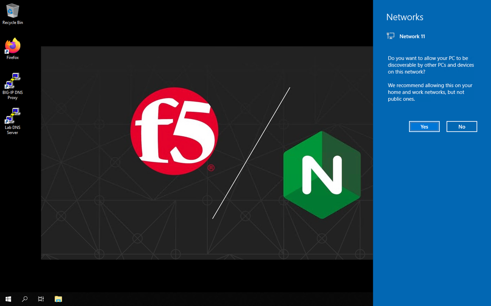
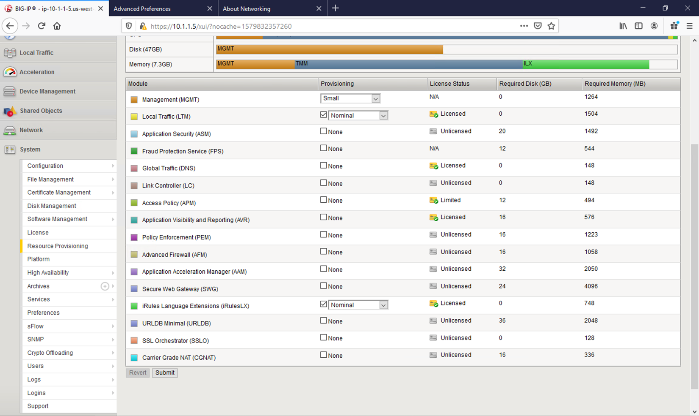
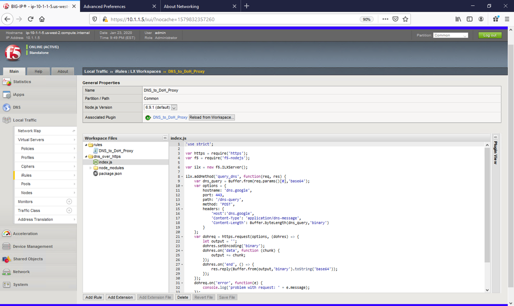
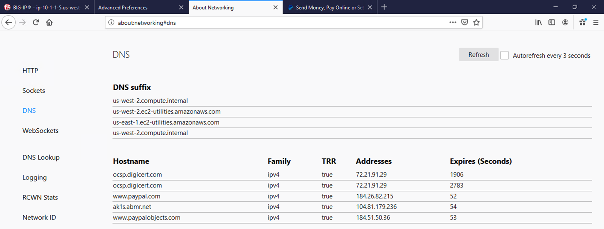
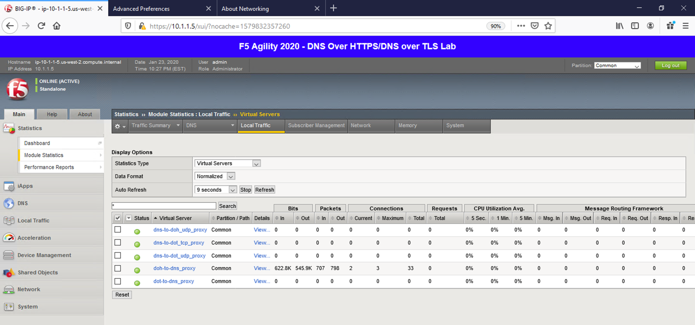
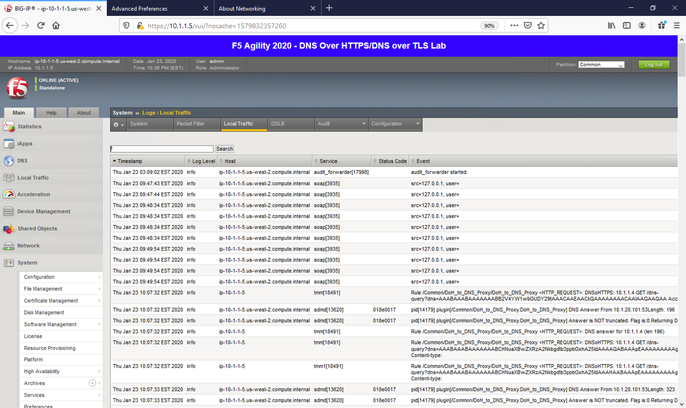
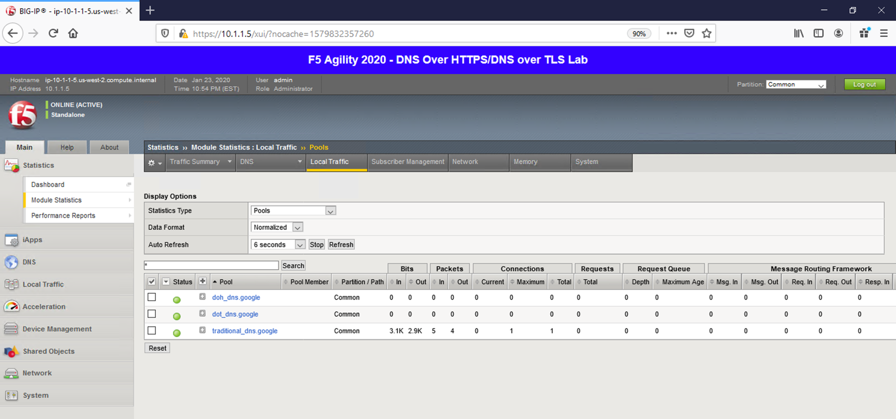
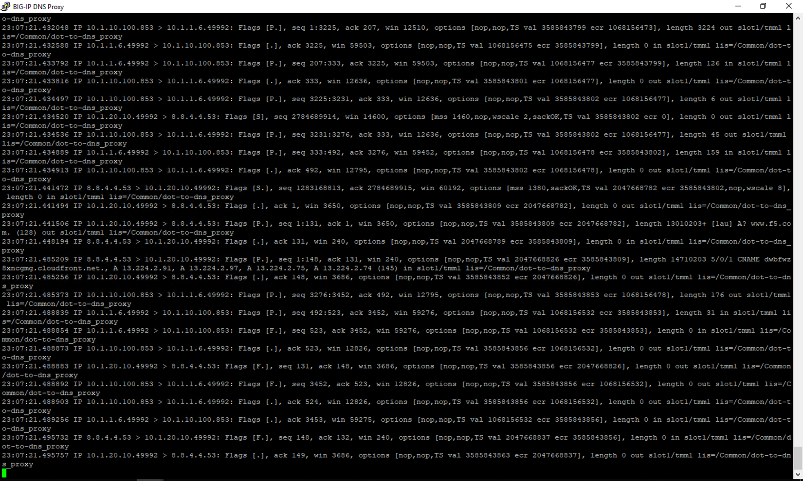
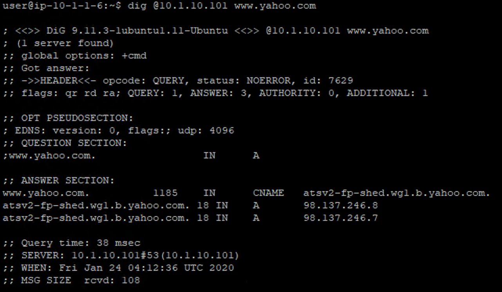
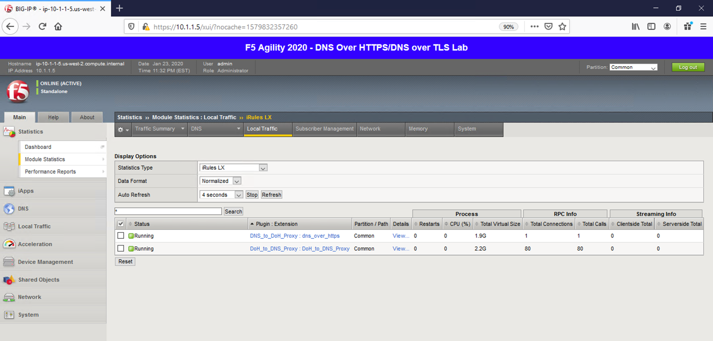

Topology
~~~~~~~~

This lab consists of a single BIG-IP that is proxying the various DNS
packet types. A single Windows jump host sits in the client segment
while an Ubuntu jump server sits in the server segment.

|image1.png|

.. |image1.png| image:: _images/image1.png
   :width: 7.5in
   :height: 5.29969in

.. |image3.png| image:: _images/image3.png
   :width: 7.5in
   :height: 4.6875in

.. |image5.png| image:: _images/image5.png
   :width: 7.5in
   :height: 4.48438in
.. |image6.png| image:: _images/image6.png
   :width: 7.5in
   :height: 4.4775in
.. |image7.png| image:: _images/image7.png
   :width: 2.39879in
   :height: 2.88051in
.. |image8.png| image:: _images/image8.png
   :width: 7.5in
   :height: 4.47917in
.. |image9.png| image:: _images/image9.png
   :width: 7.5in
   :height: 4.47917in
.. |image10.png| image:: _images/image10.png
   :width: 7.5in
   :height: 3.89006in
.. |image11.png| image:: _images/image11.png
   :width: 7.5in
   :height: 4.47917in

.. |image13.png| image:: _images/image13.png
   :width: 7.5in
   :height: 4.47917in
.. |image14.png| image:: _images/image14.png
   :width: 7.5in
   :height: 4.54167in
.. |image15.png| image:: _images/image15.png
   :width: 7.5in
   :height: 4.47917in
.. |image16.png| image:: _images/image16.png
   :width: 7.5in
   :height: 4.47917in
.. |image17.png| image:: _images/image17.png
   :width: 7.5in
   :height: 4.47917in
.. |image18.png| image:: _images/image18.png
   :width: 7.5in
   :height: 4.47917in
.. |image19.png| image:: _images/image19.png
   :width: 7.5in
   :height: 3.19271in
.. |image20.png| image:: _images/image20.png
   :width: 7.5in
   :height: 3.74479in

.. |image23.png| image:: _images/image23.png
   :width: 7.5in
   :height: 3.46314in
.. |image24.png| image:: _images/image24.png
   :width: 7.5in
   :height: 3.48958in

.. |image26.png| image:: _images/image26.png
   :width: 2.75in
   :height: 6.40278in
.. |image27.png| image:: _images/image27.png
   :width: 7.5in
   :height: 4.55208in
.. |image28.png| image:: _images/image28.png
   :width: 7.5in
   :height: 10in
.. |image29.png| image:: _images/image29.png
   :width: 7.5in
   :height: 6.98222in
.. |image30.png| image:: _images/image30.png
   :width: 7.5in
   :height: 4.76136in
.. |image31.png| image:: _images/image31.png
   :width: 7.5in
   :height: 3.45313in

.. |image35.png| image:: _images/image35.png
   :width: 7.5in
   :height: 3.49479in
.. |image36.png| image:: _images/image36.png
   :width: 7.5in
   :height: 3.46875in
.. |image37.png| image:: _images/image37.png
   :width: 7.5in
   :height: 4.47396in
.. |image38.png| image:: _images/image38.png
   :width: 7.5in
   :height: 2.99202in
.. |image39.png| image:: _images/image39.png
   :width: 7.5in
   :height: 3.50243in

.. |image41.png| image:: _images/image41.png
   :width: 7.5in
   :height: 1.45278in
